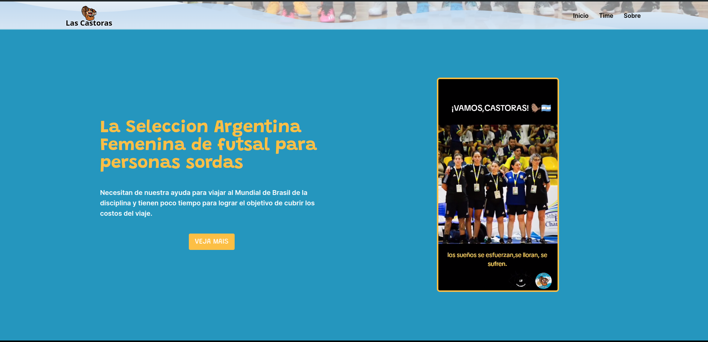

  

  

 

A Website for "Las Castoras", The Argentine women's futsal team for deaf people.

- ⚡ **Next.js** — The React Framework ( Ver. 14 )
- 🎞️ **Framer Motion** — A Animation Library
- 📏 **Eslint** — Pluggable JavaScript linter
- 🏠️ **Absolute import** — Import folders and files using the `@` prefix

## 🚀 Getting started

### Local Run

Run the following commands inside the project folder:

1. `pnpm install`
2. `pnpm dev`

To view the project open `http://localhost:3000`

